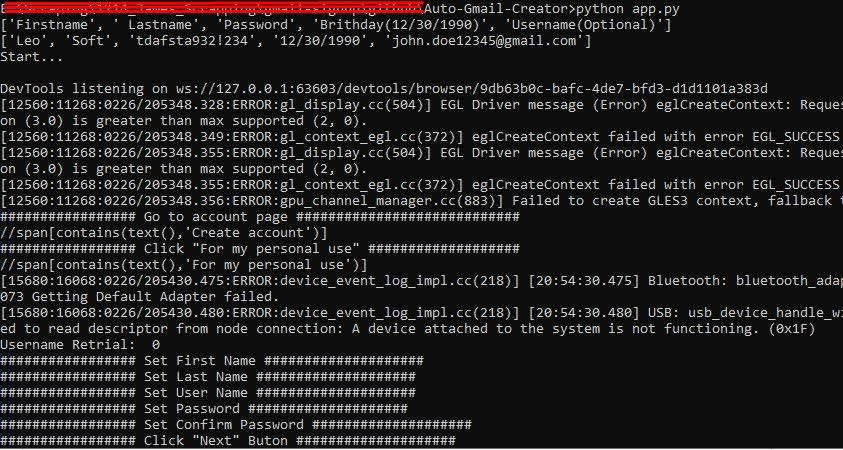
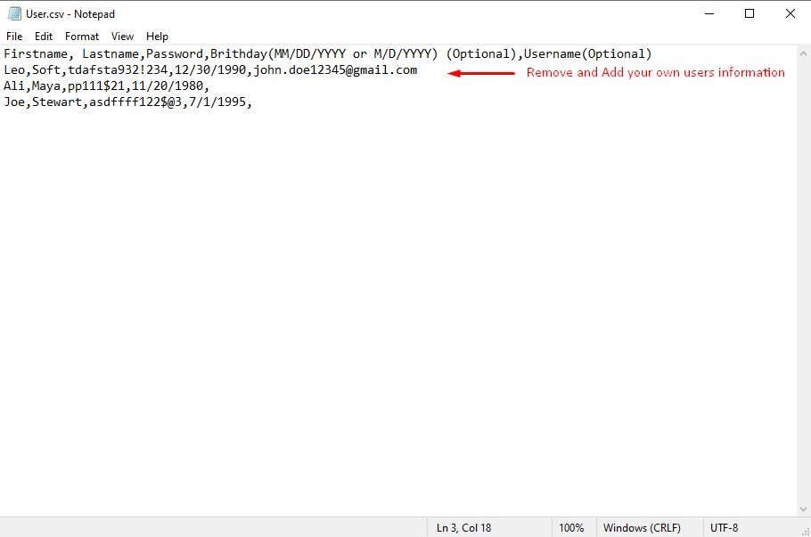
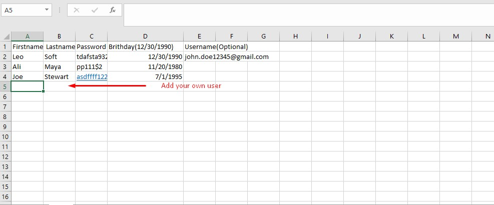
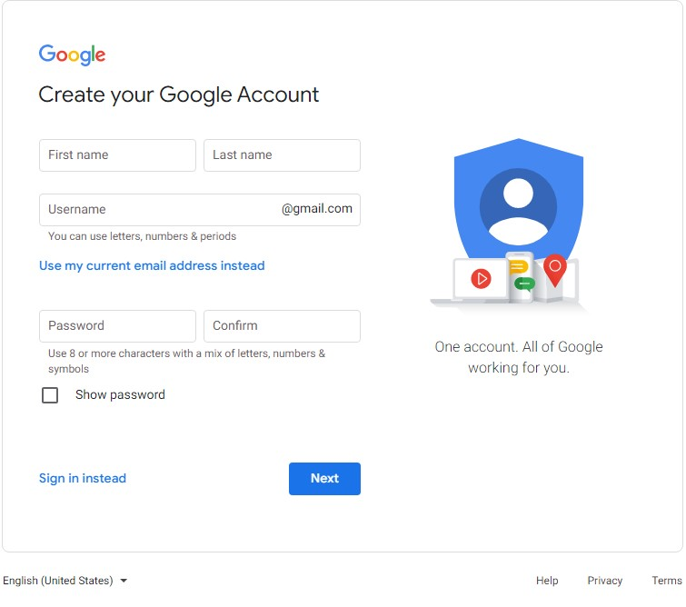
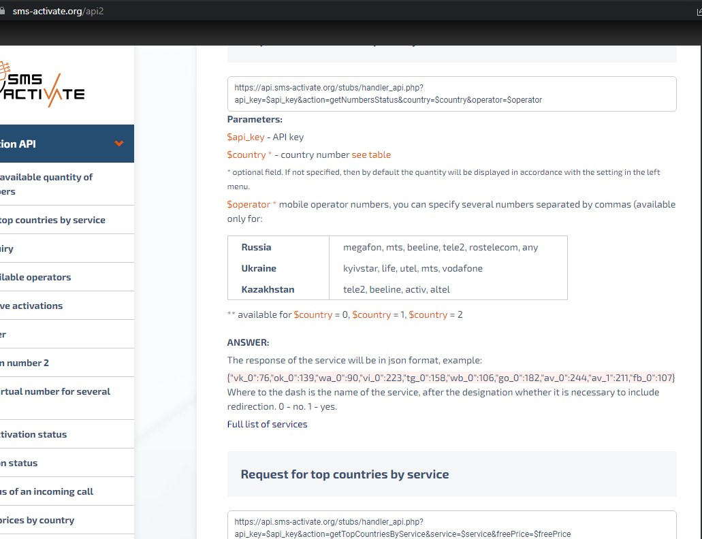

# Auto-Gmail-Creator

## Summary
Latest Open Source Bulk Auto Google Account ( Gmail ) Regiteration Bot Script 2023

<a class="github-fork-ribbon right-top" href="https://github.com/leostech/Auto-Gmail-Creator/fork" data-ribbon="Fork me on GitHub" title="Fork me on GitHub">Fork me on GitHub</a> 

According to [Jonathan](https://www.quora.com/profile/Jonathan-Elder)'s desription ,only about five gmail addresses can be verified on a single phone number.

This script uses [sms-activate.org](https://sms-activate.org) api for phone verification and more services will be added.

To run the script, you don't need to download Chromedriver or Geckodriver manually. The script does it automatically with webdriver manager.

You can customize this script to avoid getting blocked. I am also developing another script with Requests but going to keep it private since it will be blocked if I let it public.

Also, Feel free to contact me if you have any project regarding Automation, Scraping, Machine Learning.

## Usage
1. Install Python 3.x.
2. ```pip install -r requirements.txt``` 
3. ```python app.py```
4. 'Created.txt' will be generated for successful creation.

## Customize
### Browser [ Chrome, Firefox ]
Switch from Chrome to Firefox by commenting 2 lines.
```
#options = ChromeOptions()
options = FirefoxOptions()

#driver = webdriver.Chrome(service=Service(ChromeDriverManager().install()), options = options, seleniumwire_options=seleniumwire_options)

driver = webdriver.Firefox(service=Service(GeckoDriverManager().install()), options = options, seleniumwire_options=seleniumwire_options)

```
### Manual or Automatic User info generation
You edit the 'User.csv' with given type such as First name, Last name, Password, Birthday, Username(optional) from the second line.
If the 5th parameter on user.csv is not passed by userBot generates username automatically adding FN + dot + LN + random 5 digits.(john.doe12345@gmail.com)
Thanks to [BourneXu](https://github.com/BourneXu/AutoCreateGmailAccount), Script generates random popular usernames.
You can set this variant as "True" to use this functionality to automate generation.
```
AUTO_GENERATE_UERINFO = True
```
### Proxy
If you want to use socks proxy, please remove comment theses lines.
[Free Proxy list](http://free-proxy.cz/en/proxylist/country/all/socks5/ping/all/2) is here
```
    SOCKS_PROXY = "socks5://user:pass@ip:port"
```

### Headless or With UI (Optional)
```
    options.add_argument('--headless')
```

### Profile (Optional)
You can add your own profile if you want by specifying the path.
```
    options.add_argument("--incognito")
    options.add_argument(r"--user-data-dir=C:\\Users\\Username\\AppData\\Local\\Google\\Chrome\\User Data")
    options.add_argument(r'--profile-directory=ProfileName')
```
## To-Do
Try to simulate user's mouse action wity pyautogui and adding cookie, recovery email, more sms services such as Durian, 5sims.
To bypass bot-detection, I am all ears to hear from you.

## Images
- Running
    

- Edit user.csv

    With Notepad
    

    With Excel
    

- Bot will create chrome browser repeatedly for each gmail.
    

- You can visit [sms-activate.org](https://sms-activate.org) to see it's apis.
    

- To see the country code, you can hit here.
    
    

## Email

leoshabit@gmail.com

## Telegram

https://t.me/leoshabit

## Discord

leoshabit#0825

## Skype

https://join.skype.com/invite/H6S0RFA69GNK


## Github

https://github.com/leoshabit

## Phone

+12292995932

