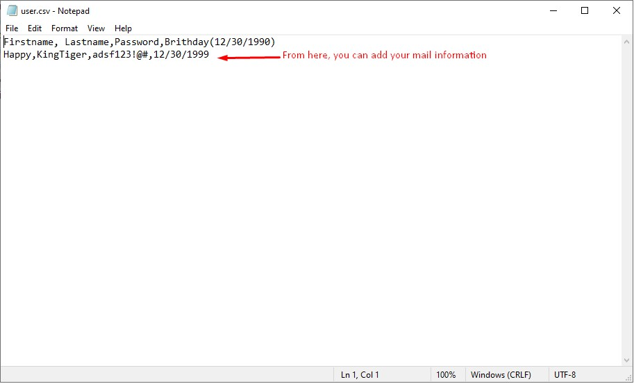
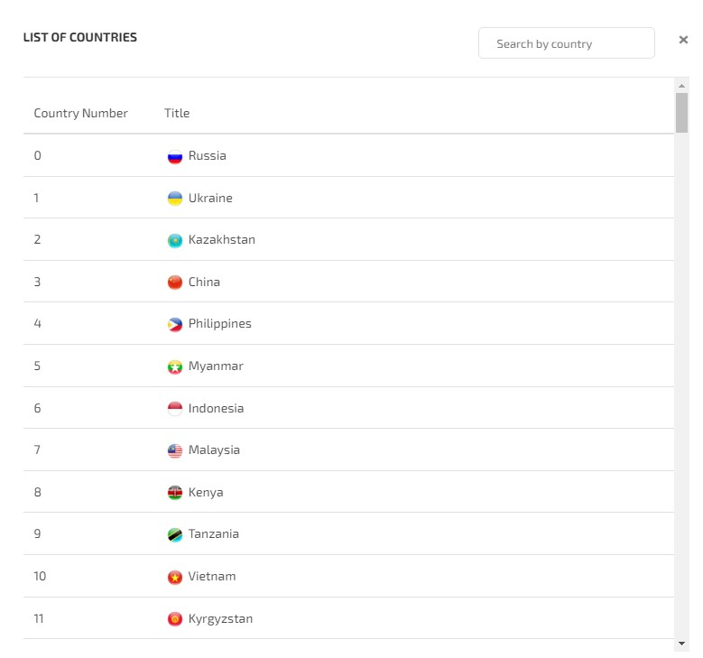

# Auto-Gmail-Creator

Auto Gmail Creation Script

This script uses [sms-activate.org](https://sms-activate.org) api for phone verification but please note that they charge tiny money.

You don't need to download Chromedriver manually. The script does it automatically with webdriver manager. Is it helpful? But you need to use Chrome Browser in your PC in general.

1. Install Dependencies with "pip install -r requirements.txt"
    - Python 3.x
    - selenium==4.8.2
    - selenium_wire==5.1.0
    - webdriver_manager==3.8.5
2. Run script 
    - You need to  edit the 'user.csv' file with given type such as First name, Last name, password, Birthday ( from the second line )
    - Bot will generate username concating FN and LN and random 4 digits.
    - you can edit the script as you want.
    
    "python app.py" or "python3 app.py"

3. Once the account is created, there will be 'created_accounts.txt'

- Editing the user.csv
    

- Bot will create chrome browser repeatedly for each gmail.
    

- You can visit [sms-activate.org](https://sms-activate.org) to see it's apis.
    

    

    
    

## Github

https://github.com/leostech

## Email

tr.soft.engineer@gmail.com

## Skype

https://join.skype.com/invite/H6S0RFA69GNK

## Telegram

https://t.me/softengineer1210

## Phone

+1 229 299 5932

If you like it, Please donate here. Thanks. :)

Ether: 0x9e701A56AA42cD89D4bD386c229Ed1A8e83E6257

