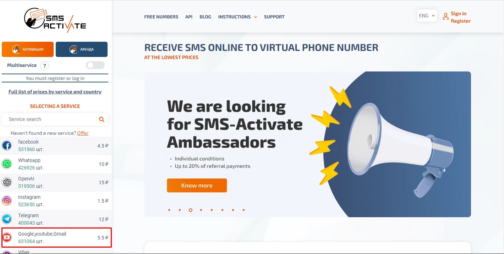

# Auto-Gmail-Creator

Auto Gmail Creation Script

This script uses [sms-activate.org](https://sms-activate.org) api for phone verification.

You don't need to download Chromedriver manually. The script does it automatically with webdriver manager.

This script uses Seleniumwire for proxy rotation.

If you need, you can modify.

1. Install Dependencies with "pip install -r requirements.txt"
    - Python 3.x
    - selenium==4.8.2
    - selenium_wire==5.1.0
    - webdriver_manager==3.8.5
2. Run script 
    - you will edit the 'user.csv' file with given type such as First name, Last name, password, Birthday
    - bot will generate username concating FN and LN and random 4 digits.
    - once the account is created, there will be 'created_accounts.txt'
    - you can edit the script as you want.
    
    "python app.py" or "python3 app.py"
    

You can visit [sms-activate.org](https://sms-activate.org) to see it's apis.
    
    

## Github

https://github.com/leostech

## Email

tr.soft.engineer@gmail.com

## Skype

https://join.skype.com/invite/H6S0RFA69GNK

## Telegram

https://t.me/softengineer1210

## Phone

+1 229 299 5932

